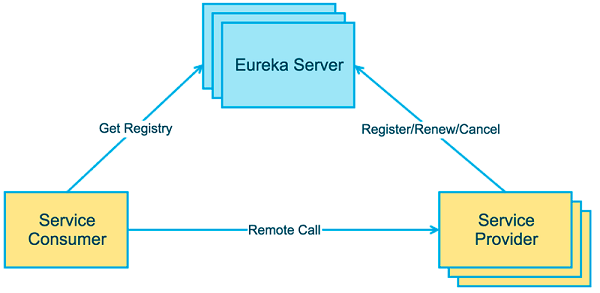

## Service register and discovery with eureka

### Principal

### About this example

There are three module for this project, service, client and consumer. Most of the time, Eureka client is both a service
provider and a consumer. In other words, its own interface can be accessed by other services, and it can also call the
interface of others.

1. Start a Eureka Service Register     
   We need to add dependency of `spring-cloud-starter-netflix-eureka-server`, and also add the annotation
   of `@EnableEurekaServer` to the startup class.

2. Start a Eureka client, which is the service provider    
   We had added these two dependencies `spring-cloud-starter-netflix-eureka-client` and `spring-boot-starter-web`

4. Set up a Eureka server cluster

4 Create a service consumer.