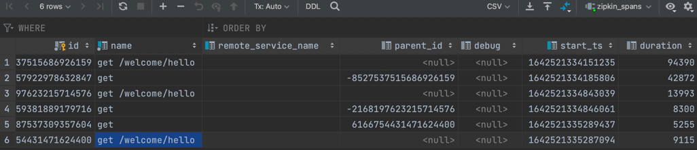

## Set up a eureka server

Set up a eureka server for service registration and discovery, we can refer to the project `spring-cloud-eureka`, we set
up the server in `eureka-server-scs` folder. 

1. Package the module
```shell
./mvnw -s /path/to/settings.xml clean package
```

2. Set up two server
   1. `java -jar target/eureka-server-scs-0.0.1-SNAPSHOT.jar --spring.profiles.active=peer1
      `
   2. `java -jar target/eureka-server-scs-0.0.1-SNAPSHOT.jar --spring.profiles.active=peer2`    

3. Check the server status
```shell
http://localhost:8080/
http://localhost:8081/
```

## Set up two service provider

Set up two service provider and invoke each other, that is `service-provider-one` and `service-provider-two`.

1. Set up service provider one
   1. Enter the folder `service-provider-one`
   2. `./mvnw -s /path/to/settings.xml clean package`
   3. Run the service:
   ```shell
    java -jar target/service-provider-one-0.0.1-SNAPSHOT.jar
   ```
2. Set up service provider two     
The operation is the same as above (service provide one).

## Start a zipkin server

Set up a zipkin server with docker compose, the configuration file is located in root directory, that
is `docker-compose.yml`, we store the trace information in MySQL.

After setting up the MySQL server with docker, we need to follow the steps below to apply the scheme:

1. Barracuda supports compression (In AWS RDS, this must be assigned in a parameter group)
```sql
mysql -uroot -e "SET GLOBAL innodb_file_format=Barracuda"
```
2. This command should work even in RDS, and return "Barracuda"
```sql
mysql -uroot -e "show global variables like 'innodb_file_format'"
```
3. `mysql -uroot -e "create database if not exists zipkin"`
4. `mysql -uroot -Dzipkin < zipkin-storage/mysql-v1/src/main/resources/mysql.sql`
5. Check the trace information via web ui
```shell
http://localhost:9411/zipkin/
```
6. Check the trace information that is delivered to MySQL
